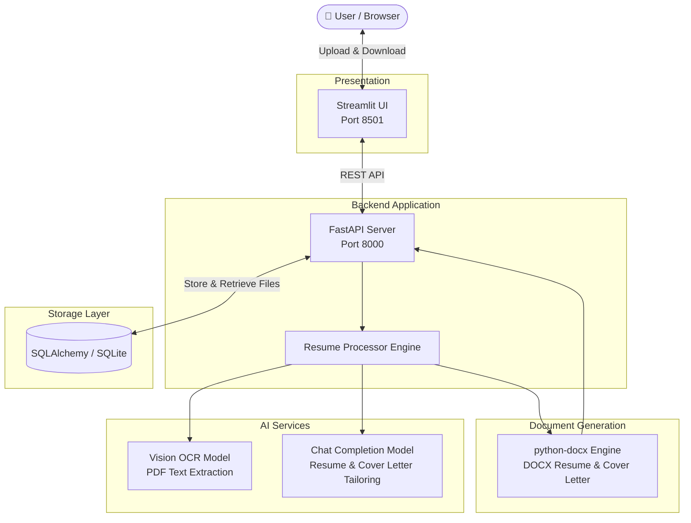
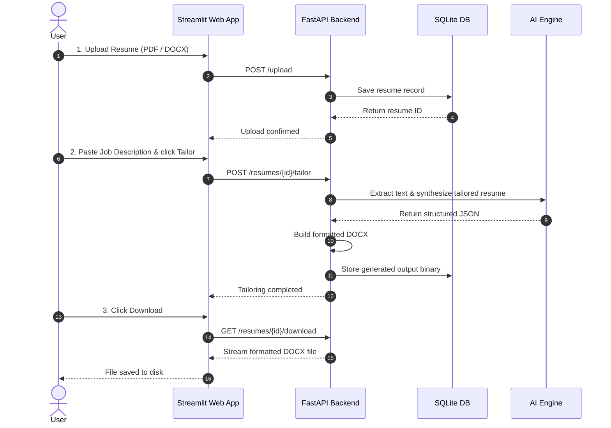

# Resume Tailor 📄✨

[](https://www.python.org/)
[](https://fastapi.tiangolo.com/)
[](https://streamlit.io/)
[](LICENSE)
[](Dockerfile)
[](https://huggingface.co/spaces)

> **AI-powered resume tailoring and cover letter generation tool.**  
> Upload your existing resume (PDF or DOCX), paste a job description, and automatically get an ATS-optimized resume and a personalized cover letter tailored to the target role.

---

## 🚀 Key Features

- 🎯 **Targeted Resume Tailoring:** Rewrites resume bullets, professional summary, and skills to highlight keywords from the job description.
- ✉️ **Cover Letter Generation:** Crafts a personalized, 3-to-4 paragraph cover letter aligning candidate experience with role requirements.
- 👁️ **Multimodal PDF Extraction:** Uses vision AI models (`gpt-4o-mini`) and `pypdfium2` to parse multi-column, styled PDF resumes with high accuracy.
- 📝 **Native Word Export:** Generates clean, ATS-compliant `.docx` Word documents ready to submit or edit.
- ⚡ **Dual Architecture:** Fast **FastAPI** backend paired with an intuitive **Streamlit** user interface.
- 🔌 **Multi-Provider AI Support:** Works seamlessly with OpenAI, Google Gemini, Groq, or local models via Ollama.

---

## 🏗️ System Architecture



---

## 🔄 User Workflow



---

## 📦 Quick Start

### 1. Prerequisites
- **Python 3.11+**
- **OpenAI API Key** (or Gemini / Groq / Ollama setup)
- **Git**

### 2. Installation

```bash
# 1. Clone the repository
git clone https://github.com/dreww01/resume-maker.git
cd resume-maker

# 2. Create and activate a virtual environment
python -m venv .venv
source .venv/bin/activate  # On Windows: .venv\Scripts\activate

# 3. Install dependencies
pip install -r requirements.txt
```

### 3. Environment Configuration

Copy the sample environment file:

```bash
cp .env.example .env
```

Edit `.env` with your OpenAI credentials:

```env
OPENAI_API_KEY=sk-proj-your-openai-key-here
AI_MODEL=gpt-4o-mini
VISION_MODEL=gpt-4o-mini
```

---

## 💻 Running the Application

### Option A: Local Development (Two Terminals)

**Terminal 1 (Backend API):**
```bash
uvicorn src.api:app --reload --port 8000
```
*API Swagger Documentation is available at [http://localhost:8000/docs](http://localhost:8000/docs).*

**Terminal 2 (Streamlit UI):**
```bash
streamlit run src/frontend.py
```
*Web application opens automatically at [http://localhost:8501](http://localhost:8501).*

---

### Option B: Unified Service Runner (`run.sh`)

Start both backend and frontend together with `run.sh` (handles environment setup, port checks, backend health waiting, and graceful signal cleanup):

```bash
chmod +x run.sh
./run.sh
```

You can also run specific lifecycle modes:

```bash
./run.sh backend    # Start only the FastAPI backend (:8000)
./run.sh frontend   # Start only the Streamlit frontend (:8501)
./run.sh test       # Run pytest test suite
./run.sh health     # Probe active backend and frontend health
./run.sh --help     # Display CLI usage and options
```

---

### Option C: Docker

Build and run using Docker:

```bash
# Build image
docker build -t resume-tailor .

# Run container
docker run -p 8501:8501 -p 8000:8000 -e OPENAI_API_KEY="your-key-here" resume-tailor
```

Open [http://localhost:8501](http://localhost:8501) in your browser.

---

## ⚙️ Configuration & Environment Variables

| Variable | Required | Default | Description |
| :--- | :---: | :--- | :--- |
| `OPENAI_API_KEY` | **Yes** | — | API key for OpenAI or compatible provider. |
| `OPENAI_BASE_URL` | No | — | Base URL for OpenAI-compatible providers (e.g. Gemini, Groq, Ollama). |
| `AI_MODEL` | No | `gpt-4o-mini` | Model used for resume tailoring and cover letters. |
| `VISION_MODEL` | No | `gpt-4o-mini` | Vision model used for PDF OCR parsing. |
| `DATABASE_URL` | No | `sqlite:///:memory:` | SQLAlchemy connection string (e.g. `sqlite:///resume.db`). |
| `API_URL` | No | `http://127.0.0.1:8000` | Backend API URL used by the Streamlit frontend. |

### 🤖 Free & Alternative AI Models

You can easily switch to free or self-hosted models by configuring environment variables:

- **Google Gemini (Free tier):** Set `OPENAI_BASE_URL="https://generativelanguage.googleapis.com/v1beta/openai/"`, `AI_MODEL=gemini-2.0-flash`, `VISION_MODEL=gemini-2.0-flash`, and provide your Gemini API key in `OPENAI_API_KEY`.
- **Groq (Ultra-fast & free tier):** Set `OPENAI_BASE_URL="https://api.groq.com/openai/v1"`, `AI_MODEL=llama-3.1-70b-versatile`, `VISION_MODEL=llama-3.2-90b-vision-preview`, and set `OPENAI_API_KEY`.
- **Ollama (100% Free & Local):** Set `OPENAI_BASE_URL="http://localhost:11434/v1"`, `OPENAI_API_KEY=ollama`, `AI_MODEL=llama3.1`, `VISION_MODEL=llava`.

> For complete multi-provider configuration details, see [docs/AI_MODELS.md](docs/AI_MODELS.md).

---

## 🔌 API Endpoints Summary

| Method | Endpoint | Description |
| :--- | :--- | :--- |
| `GET` | `/` | Health check & welcome message. |
| `POST` | `/upload` | Upload resume file (`.pdf` or `.docx`). |
| `POST` | `/resumes/{id}/tailor` | Tailor resume against a plain text job description. |
| `POST` | `/resumes/{id}/cover-letter` | Generate a customized cover letter for the job. |
| `GET` | `/resumes/{id}` | Query resume status and metadata. |
| `GET` | `/resumes/{id}/download` | Download generated tailored resume (`.docx`). |
| `GET` | `/resumes/{id}/cover-letter/download` | Download generated cover letter (`.docx`). |

> For full request/response schemas, status codes, and curl examples, see [docs/API.md](docs/API.md).

---

## 📂 Project Structure

```
resume-maker/
├── docs/                     # Comprehensive project documentation
│   ├── ARCHITECTURE.md       # System design & sequence diagrams
│   ├── DATABASE.md           # Database schema & ER diagrams
│   ├── API.md                # REST API reference & examples
│   ├── AI_MODELS.md          # Multi-provider AI setup guide
│   ├── DEVELOPMENT.md        # Local development & testing guide
│   └── DEPLOYMENT.md         # Docker & Hugging Face deployment
├── src/                      # Source code
│   ├── __init__.py
│   ├── api.py                # FastAPI backend REST API
│   ├── frontend.py           # Streamlit user interface
│   ├── database.py           # SQLAlchemy ORM models & session manager
│   ├── resume_processor.py   # OCR, prompt execution & DOCX generation
│   └── prompts/              # System & user prompt templates
│       ├── __init__.py
│       ├── resume_tailor.py  # Resume tailoring prompts
│       └── cover_letter.py   # Cover letter prompts
├── tests/                    # Automated unit & integration tests
│   ├── test_database.py      # Database layer tests
│   ├── test_processor.py     # Document & prompt tests
│   ├── test_api.py           # FastAPI endpoint tests
│   └── test_launcher.py      # Service launcher & CLI tests
├── .github/                  # GitHub workflows & templates
│   ├── workflows/sync-to-hf.yml
│   ├── ISSUE_TEMPLATE/
│   └── PULL_REQUEST_TEMPLATE.md
├── Dockerfile                # Docker container specification
├── run.sh                    # Unified service lifecycle & test runner
├── start.sh                  # Backward-compatibility startup script
├── pyproject.toml            # Project dependencies & tool config
├── requirements.txt          # Python package requirements
├── .env.example              # Environment variables template
├── CONTRIBUTING.md           # Contribution guidelines
├── CODE_OF_CONDUCT.md        # Community code of conduct
├── SECURITY.md               # Security & vulnerability reporting
├── CHANGELOG.md              # Version release history
├── LICENSE                   # MIT License
└── README.md                 # Project README
```

---

## 📚 Documentation Index

For in-depth guides and references, check out the `docs/` folder:

| Document | Description |
| :--- | :--- |
| 🏛️ **[System Architecture](docs/ARCHITECTURE.md)** | Detailed high-level design, component breakdown, and Mermaid sequence diagrams. |
| 🗄️ **[Database Reference](docs/DATABASE.md)** | Entity relationship diagrams, table schema specifications, and SQLAlchemy session management. |
| 📡 **[API Reference](docs/API.md)** | Complete endpoint specifications, headers, request/response bodies, and HTTP status codes. |
| 🧠 **[AI Models & Providers](docs/AI_MODELS.md)** | Vision OCR pipeline, prompt templates, JSON schema, and setup for OpenAI, Gemini, Groq, and Ollama. |
| 🛠️ **[Development Guide](docs/DEVELOPMENT.md)** | Local environment setup, running tests with `pytest`, coding standards, and troubleshooting. |
| 🚀 **[Deployment Guide](docs/DEPLOYMENT.md)** | Deploying to Hugging Face Spaces, Docker containerization, and production best practices. |

---

## 🤝 Open Source & Community

We welcome contributions from the community! Please review our open source standards before contributing:

- 📜 **[Code of Conduct](CODE_OF_CONDUCT.md)**: Community rules and pledge.
- 🛠️ **[Contributing Guide](CONTRIBUTING.md)**: Step-by-step contribution instructions.
- 🔒 **[Security Policy](SECURITY.md)**: How to report security vulnerabilities responsibly.
- 📋 **[Changelog](CHANGELOG.md)**: History of releases and notable changes.
- 📄 **[License](LICENSE)**: MIT License terms.

---

## 🧪 Testing

Run the automated test suite locally:

```bash
pytest
```

---

## 📄 License

This project is open source and available under the [MIT License](LICENSE).
