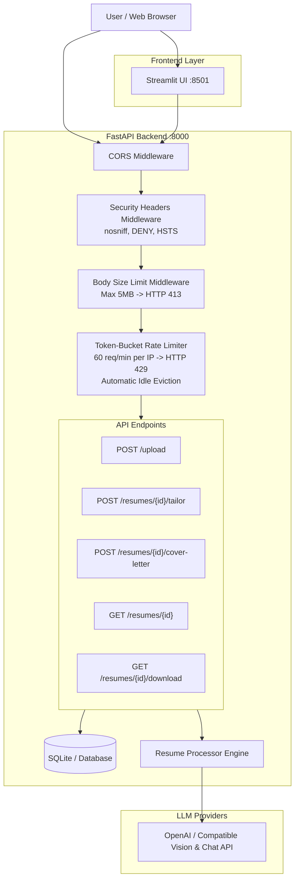
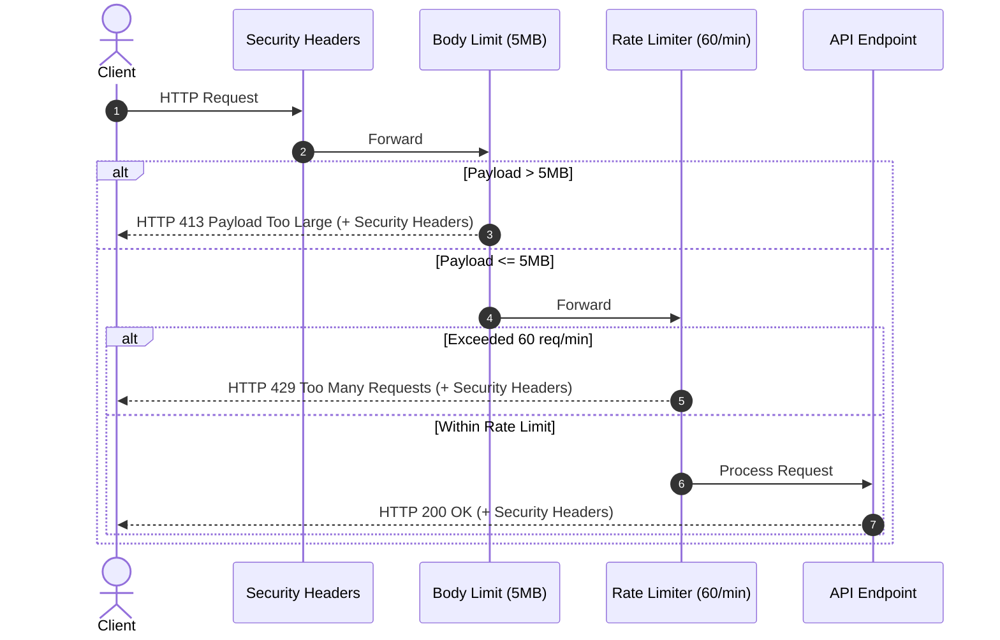

# Resume Tailor

AI-powered resume tailoring and cover letter generation platform. Upload an existing resume (PDF/DOCX), provide a target job description, and generate an ATS-optimized, professionally tailored resume and personalized cover letter.

---

## System Architecture



---

## Features

- **Resume Tailoring**: Intelligently restructures and aligns your experience with target job keywords.
- **Cover Letter Generation**: Drafts targeted, compelling cover letters tailored to the specific role.
- **ATS Optimization**: Ensures content hierarchy, formatting, and keyword density pass Applicant Tracking Systems.
- **Multi-Format Ingestion**: Parses `.pdf` (via vision extraction) and `.docx` source resumes.
- **DOCX Export**: Produces cleanly styled, downloadable Word documents.
- **Production Hardening**: Comprehensive DoS mitigation, payload size enforcement, IP rate limiting, and defensive security headers.

---

## Security & Reliability Hardening



### 1. Request Body Size Limit Middleware
- Rejects oversized requests exceeding **5MB** with `HTTP 413 Payload Too Large`.
- Protects the application from memory exhaustion and large payload upload abuse.

### 2. Token-Bucket Rate Limiter with Idle Eviction
- Enforces a maximum of **60 requests per minute** per client IP on sensitive endpoints (`/upload`, `/resumes/{id}/tailor`, `/resumes/{id}/cover-letter`).
- Returns `HTTP 429 Too Many Requests` when limits are exceeded.
- Automatically evicts inactive IP entries after idle periods to guarantee bounded memory usage.

### 3. Security Response Headers Middleware
Injected on all responses across the application:
- `X-Content-Type-Options: nosniff` (prevents MIME-type sniffing)
- `X-Frame-Options: DENY` (clickjacking protection)
- `Strict-Transport-Security: max-age=31536000; includeSubDomains` (enforces HTTPS)

---

## Prerequisites

- **Python**: 3.11 or higher
- **OpenAI API Key**: (or API key for OpenAI-compatible providers like Gemini, Groq, or Ollama)

---

## Installation & Setup

### 1. Clone Repository
```bash
git clone https://github.com/dreww01/resume-maker.git
cd resume-maker
```

### 2. Create Virtual Environment
```bash
python -m venv .venv
source .venv/bin/activate  # On Windows: .venv\Scripts\activate
```

### 3. Install Dependencies
```bash
pip install -r requirements.txt
```

### 4. Configure Environment Variables
Copy `.env.example` to `.env` and set your credentials:
```bash
cp .env.example .env
```

| Variable | Required | Default | Description |
|---|---|---|---|
| `OPENAI_API_KEY` | **Yes** | - | OpenAI API Key or compatible provider key |
| `AI_MODEL` | No | `gpt-4o-mini` | LLM model for text tailoring and cover letters |
| `VISION_MODEL` | No | `gpt-4o-mini` | Vision LLM model for PDF text extraction |
| `DATABASE_URL` | No | `sqlite:///:memory:` | SQLAlchemy database connection string |

---

## Running the Application

### Option A: Startup Script (Runs Backend & Frontend)
```bash
chmod +x start.sh
./start.sh
```

### Option B: Run Services Separately

**1. Start the FastAPI backend:**
```bash
uvicorn src.api:app --reload --port 8000
```

**2. Start the Streamlit frontend:**
```bash
streamlit run src/frontend.py --server.port 8501
```

Access the UI at `http://localhost:8501` and interactive Swagger API documentation at `http://localhost:8000/docs`.

---

## API Reference

| Method | Endpoint | Description | Rate Limited | Body Limit |
|---|---|---|---|---|
| `GET` | `/` | API health & welcome message | No | Standard |
| `POST` | `/upload` | Upload resume file (`.pdf` or `.docx`) | **Yes (60/min)** | **5 MB** |
| `POST` | `/resumes/{id}/tailor` | Tailor resume against job description | **Yes (60/min)** | **5 MB** |
| `POST` | `/resumes/{id}/cover-letter` | Generate personalized cover letter | **Yes (60/min)** | **5 MB** |
| `GET` | `/resumes/{id}` | Check resume processing status | No | Standard |
| `GET` | `/resumes/{id}/download` | Download tailored resume (`.docx`) | No | Standard |
| `GET` | `/resumes/{id}/cover-letter/download` | Download generated cover letter (`.docx`) | No | Standard |

---

## Alternative LLM Providers

Because Resume Tailor uses the OpenAI SDK standard, you can point it to alternative providers:

- **Google Gemini**: Set `OPENAI_API_KEY=your-gemini-key`, `AI_MODEL=gemini-2.0-flash`.
- **Groq**: Set `OPENAI_API_KEY=your-groq-key`, `AI_MODEL=llama-3.1-70b-versatile`.
- **Ollama (Local)**: Set `OPENAI_API_KEY=ollama`, `AI_MODEL=llama3.1`, `VISION_MODEL=llava`.

---

## Testing & Verification

Run the automated test suite with pytest:

```bash
pytest -v
```

Run security-specific verification tests (covering rate limiting, payload limits, and security headers):

```bash
pytest tests/test_security.py -v
```

---

## Project Structure

```
resume-maker/
├── src/
│   ├── __init__.py
│   ├── api.py                  # FastAPI backend routes & application setup
│   ├── security.py             # Rate limiter, body size limit, and security middlewares
│   ├── database.py             # SQLAlchemy models and database session management
│   ├── resume_processor.py     # PDF vision extraction, LLM orchestration, DOCX generation
│   ├── frontend.py             # Streamlit user interface
│   └── prompts/
│       ├── __init__.py
│       ├── resume_tailor.py    # Resume tailoring prompt templates
│       └── cover_letter.py     # Cover letter prompt templates
├── tests/
│   └── test_security.py        # Security & DoS hardening test suite
├── Dockerfile                  # Container definition for deployment
├── pyproject.toml              # Build metadata & configuration
├── requirements.txt            # Python dependencies
├── start.sh                    # Dual-service local launcher script
├── .env.example                # Example environment variables
└── README.md                   # Project documentation
```

---

## Deployment (Docker & Hugging Face Spaces)

This project includes Docker support configured for Hugging Face Spaces:

1. Create a new Space on Hugging Face using the **Docker** SDK.
2. In your Space Settings, add your `OPENAI_API_KEY` under **Repository Secrets**.
3. Push the repository to the Space remote:
   ```bash
   git push origin main
   ```
4. The application automatically exposes the frontend and backend on port `7860`.

---

## License

This project is licensed under the [MIT License](LICENSE).
