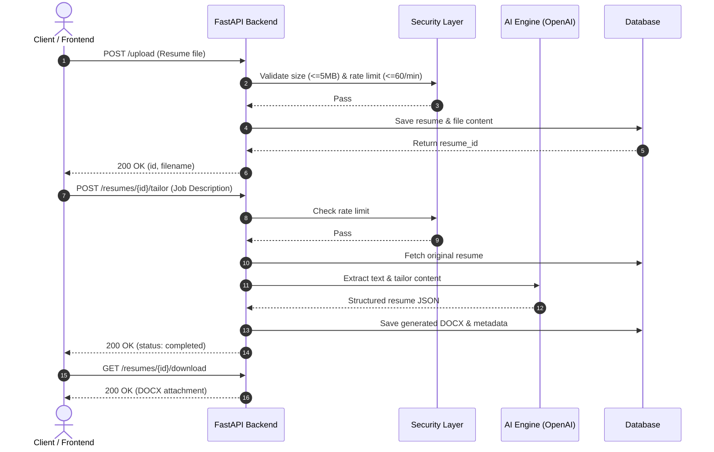

# Resume Tailor

AI-powered resume tailoring and cover letter generation tool. Upload your resume, provide a job description, and get an ATS-optimized resume and tailored cover letter formatted for modern hiring workflows.

---

## Architecture Overview

```mermaid
flowchart TD
    User([User / Browser])
    Frontend["Streamlit Frontend (:8501)"]
    API["FastAPI Backend (:8000)"]

    subgraph Security Layer ["Security & Protection Layer"]
        SecHeaders["Security Headers Middleware\n(nosniff, DENY, HSTS)"]
        SizeLimit["Body Size Limit Middleware\n(Max 5MB -> 413)"]
        RateLimiter["Token-Bucket Rate Limiter\n(60 req/min per IP -> 429)"]
    end

    subgraph Storage & Processing ["Core Services"]
        DB[(SQLite / PostgreSQL DB)]
        Processor["Resume Processor\n(Docx / PDF Vision Extractor)"]
        OpenAI["AI Engine\n(OpenAI / Gemini / Groq)"]
    end

    User -->|Upload / Tailor / Download| Frontend
    Frontend -->|HTTP Requests| API
    API --> SecHeaders --> SizeLimit --> RateLimiter
    RateLimiter -->|Process Request| DB
    RateLimiter -->|Extract & Transform| Processor
    Processor -->|LLM Prompts| OpenAI
```



---

## Key Features

- **Resume Tailoring**: Rewrites resume bullet points and summaries to match job description keywords while maintaining ATS compliance.
- **Cover Letter Generation**: Generates targeted, personalized cover letters aligned with the applicant's experience and target job.
- **Multi-Format Ingestion**: Supports `.pdf` (with vision/text extraction fallback) and `.docx` input formats.
- **Production-Grade Security Hardening**:
  - **Payload Size Enforcement**: Blocks requests exceeding 5MB with `HTTP 413 Payload Too Large`.
  - **Token-Bucket Rate Limiting**: Enforces max 60 requests/minute per client IP with `HTTP 429 Too Many Requests` and automatic idle IP eviction.
  - **Security Response Headers**: Injects `X-Content-Type-Options: nosniff`, `X-Frame-Options: DENY`, and `Strict-Transport-Security`.

---

## Workflow



---

## Prerequisites

- Python 3.11+
- OpenAI API Key (or alternative LLM endpoint)

---

## Quick Start

### 1. Clone & Setup Environment

```bash
git clone https://github.com/dreww01/resume-maker.git
cd resume-maker

python -m venv .venv
source .venv/bin/activate  # On Windows: .venv\Scripts\activate
pip install -r requirements.txt
```

### 2. Configure Environment Variables

Create `.env` from the example template:

```bash
cp .env.example .env
```

| Variable | Required | Default | Description |
|---|---|---|---|
| `OPENAI_API_KEY` | Yes | - | OpenAI API key for resume processing |
| `AI_MODEL` | No | `gpt-4o-mini` | LLM model for resume tailoring and cover letters |
| `VISION_MODEL` | No | `gpt-4o-mini` | Vision/LLM model for document extraction |
| `DATABASE_URL` | No | `sqlite:///:memory:` | SQLAlchemy database URL |

### 3. Run Locally

You can launch both the backend API and frontend with the startup script:

```bash
chmod +x start.sh
./start.sh
```

Or start them individually:

```bash
# Terminal 1: Backend API
uvicorn src.api:app --reload --port 8000

# Terminal 2: Streamlit Frontend
streamlit run src/frontend.py
```

- **Interactive API Documentation (Swagger UI)**: `http://localhost:8000/docs`
- **Streamlit Web UI**: `http://localhost:8501`

---

## API Endpoints

| Endpoint | Method | Rate Limit | Description |
|---|---|---|---|
| `/upload` | `POST` | 60 req/min | Upload resume (`.pdf` or `.docx`, max 5MB) |
| `/resumes/{id}/tailor` | `POST` | 60 req/min | Tailor resume against job description |
| `/resumes/{id}/cover-letter` | `POST` | 60 req/min | Generate custom cover letter |
| `/resumes/{id}` | `GET` | None | Get resume processing status |
| `/resumes/{id}/download` | `GET` | None | Download tailored resume DOCX |
| `/resumes/{id}/cover-letter/download` | `GET` | None | Download cover letter DOCX |

---

## Security Hardening Details

1. **Payload Size Limit (`ContentSizeLimitMiddleware`)**:
   - Rejects requests with `Content-Length > 5MB` immediately with `HTTP 413`.
   - Monitors streaming and chunked payload buffers to prevent memory exhaustion attacks.
2. **Token Bucket Rate Limiter (`TokenBucketRateLimiter`)**:
   - Thread-safe token bucket algorithm allowing burst capacity up to 60 requests per minute per IP.
   - Automatically tracks client IP (`X-Forwarded-For` aware) and evicts idle IP records.
3. **HTTP Security Headers (`SecurityHeadersMiddleware`)**:
   - `X-Content-Type-Options: nosniff` (MIME sniffing prevention)
   - `X-Frame-Options: DENY` (Clickjacking mitigation)
   - `Strict-Transport-Security: max-age=31536000; includeSubDomains` (Enforce HTTPS)

---

## Running Tests

Execute the automated test suite with pytest:

```bash
pytest
```

To run security-specific test cases:

```bash
pytest tests/test_security.py -v
```

---

## License

This project is licensed under the MIT License.
