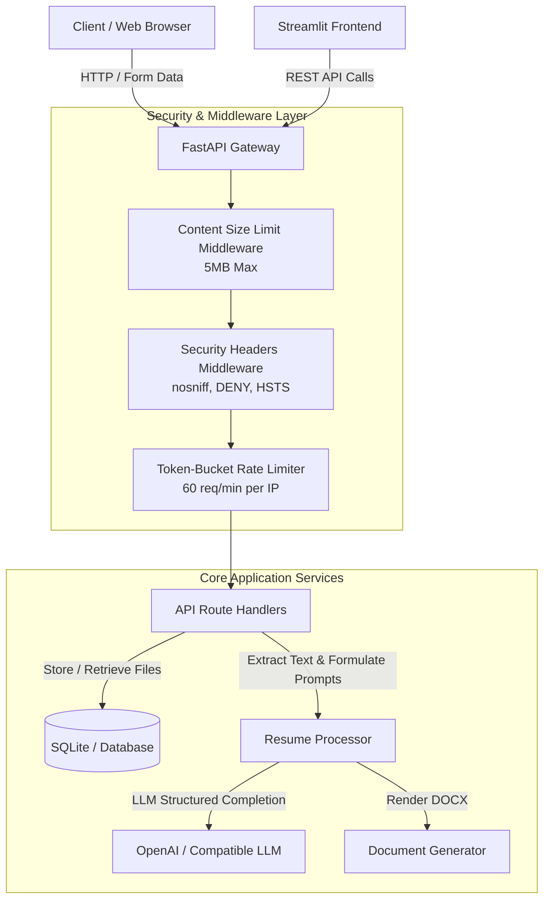
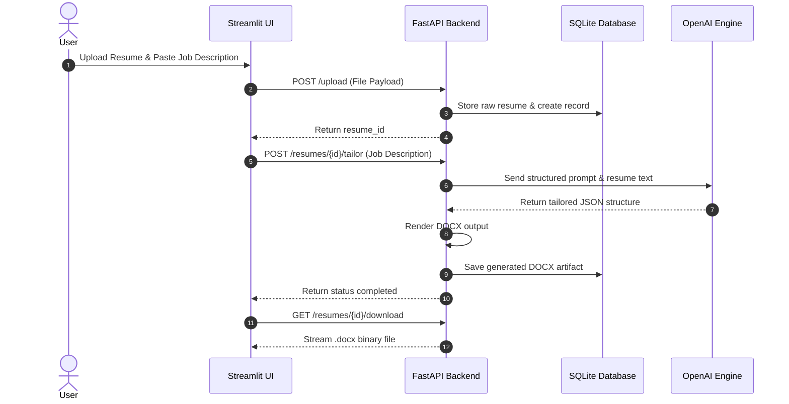

# Resume Tailor

[](https://fastapi.tiangolo.com)
[](https://www.python.org/downloads/)
[](https://streamlit.io)
[](https://opensource.org/licenses/MIT)

**Resume Tailor** is an AI-powered resume customization and cover letter generation engine. It extracts content from your existing resume (PDF/DOCX), compares it against a target job description using LLM analysis, and generates an ATS-optimized resume and personalized cover letter in clean DOCX format.

---

## Architecture Overview



---

## Features

- **Resume Tailoring**: Matches experience, skills, and bullet points to job description requirements.
- **Cover Letter Generation**: Synthesizes tailored narrative cover letters aligned with the role.
- **ATS Optimization**: Generates clean typography and keyword-rich phrasing that passes Applicant Tracking Systems.
- **Multiple Input Formats**: Supports PDF (native text & vision extraction) and DOCX input.
- **Built-in Security Hardening**:
  - **Payload Size Limiting**: 5MB request ceiling (returns `413 Payload Too Large`).
  - **In-Memory Token-Bucket Rate Limiting**: Max 60 requests/minute per client IP with idle IP cache eviction (returns `429 Too Many Requests`).
  - **Security Headers**: Injects `X-Content-Type-Options: nosniff`, `X-Frame-Options: DENY`, and `Strict-Transport-Security`.

---

## Getting Started

### Prerequisites

- Python 3.11 or higher
- OpenAI API Key (or alternative LLM provider API key)

### Installation

1. **Clone the repository:**
   ```bash
   git clone https://github.com/dreww01/resume-maker.git
   cd resume-maker
   ```

2. **Create and activate a virtual environment:**
   ```bash
   python -m venv .venv
   source .venv/bin/activate  # Linux/macOS
   # .venv\Scripts\activate   # Windows
   ```

3. **Install dependencies:**
   ```bash
   pip install -r requirements.txt
   ```

4. **Configure environment variables:**
   ```bash
   cp .env.example .env
   ```
   Open `.env` and configure your keys.

---

## Configuration

### Environment Variables

| Variable | Required | Default | Description |
| :--- | :---: | :--- | :--- |
| `OPENAI_API_KEY` | **Yes** | — | OpenAI API authentication key |
| `AI_MODEL` | No | `gpt-4o-mini` | LLM model for resume tailoring and cover letter generation |
| `VISION_MODEL` | No | `gpt-4o-mini` | Vision-capable model for scanned PDF text extraction |
| `DATABASE_URL` | No | `sqlite:///:memory:` | SQLAlchemy database connection string |

---

## Running the Application

### Option 1: Using the Startup Script

```bash
chmod +x start.sh
./start.sh
```

### Option 2: Running Services Separately

Start the FastAPI backend:
```bash
uvicorn src.api:app --reload --port 8000
```

In a separate terminal, start the Streamlit UI:
```bash
streamlit run src/frontend.py
```

Access the web UI at `http://localhost:8501` and interactive Swagger docs at `http://localhost:8000/docs`.

---

## API Reference

### Request Flow



### Endpoints

| Method | Endpoint | Description | Rate Limited |
| :--- | :--- | :--- | :---: |
| `GET` | `/` | Service health / welcome message | No |
| `POST` | `/upload` | Upload resume file (`.pdf` or `.docx`, max 5MB) | **Yes (60/min)** |
| `POST` | `/resumes/{id}/tailor` | Tailor resume against job description | **Yes (60/min)** |
| `POST` | `/resumes/{id}/cover-letter` | Generate personalized cover letter | **Yes (60/min)** |
| `GET` | `/resumes/{id}` | Fetch processing status and metadata | No |
| `GET` | `/resumes/{id}/download` | Download generated tailored resume (`.docx`) | No |
| `GET` | `/resumes/{id}/cover-letter/download` | Download generated cover letter (`.docx`) | No |

---

## Testing

Run unit, integration, and security verification test suites with `pytest`:

```bash
pytest
```

To run security tests specifically:

```bash
pytest tests/test_security.py -v
```

---

## Project Structure

```
resume-tailor/
├── .env.example              # Template for environment variables
├── Dockerfile                # Container deployment specification
├── pyproject.toml            # Project metadata and dependencies
├── requirements.txt          # Python package requirements
├── start.sh                  # Multi-service launcher script
├── src/
│   ├── __init__.py
│   ├── api.py                # FastAPI app, security middleware & routes
│   ├── database.py           # SQLAlchemy models & database session handlers
│   ├── frontend.py           # Streamlit user interface
│   ├── resume_processor.py   # Document parsing, LLM calls, DOCX rendering
│   └── prompts/
│       ├── __init__.py
│       ├── cover_letter.py   # Cover letter prompt templates
│       └── resume_tailor.py  # Resume optimization prompt templates
└── tests/
    └── test_security.py      # Security, rate limit, and payload size tests
```

---

## License

This project is licensed under the MIT License - see the [LICENSE](LICENSE) file for details.
