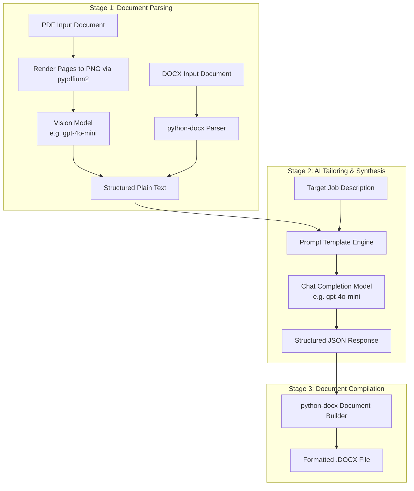

# AI Models & Processing Pipeline

This document explains the AI architecture, prompt engineering strategy, and multi-provider configuration options for **Resume Tailor**.

---

## 1. AI Pipeline Overview

Resume Tailor employs a **two-stage AI pipeline**:

1. **Stage 1 (Multimodal Vision OCR):** High-fidelity document parsing that renders PDF pages as images and passes them to a vision model. This guarantees that complex layouts, two-column grids, headers, and visual styling are preserved accurately.
2. **Stage 2 (Structured LLM Synthesis):** Tailoring the extracted text against the target job description using a chat completion model with enforced JSON mode.



---

## 2. Model Roles & Configuration

| Environment Variable | Default Value | Description |
| :--- | :--- | :--- |
| `OPENAI_API_KEY` | *(Required)* | API key for the AI provider. |
| `OPENAI_BASE_URL` | *(Optional)* | Custom base URL for OpenAI-compatible alternative providers. |
| `AI_MODEL` | `gpt-4o-mini` | Model used for resume tailoring and cover letter generation. |
| `VISION_MODEL` | `gpt-4o-mini` | Multimodal model used for PDF text extraction. |

---

## 3. Prompt Engineering & JSON Schema

### 3.1 Resume Tailoring

The tailoring prompt instructs the model to act as an expert resume writer and ATS specialist:

- **Keywords:** Naturally incorporate relevant hard skills, frameworks, and domain terms from the job description.
- **Action Verbs & Impact:** Rewrite bullet points to focus on quantifiable achievements and active verbs.
- **Truthfulness:** Adapt existing experience to highlight relevant aspects without hallucinating non-existent degrees or companies.
- **JSON Schema:** Returns structured JSON with the following schema:

```json
{
  "name": "Candidate Full Name",
  "email": "candidate@example.com",
  "phone": "+1 (555) 000-0000",
  "location": "City, State / Country",
  "github": "github.com/username",
  "linkedin": "linkedin.com/in/username",
  "portfolio": "https://portfolio.com",
  "professional_summary": "Summary tailored to the job description...",
  "work_experience": [
    {
      "title": "Job Title",
      "company": "Company Name",
      "duration": "Month Year - Month Year",
      "bullets": [
        "Tailored achievement bullet point 1...",
        "Tailored achievement bullet point 2..."
      ]
    }
  ],
  "projects": [
    {
      "name": "Project Name",
      "bullets": [
        "Project description and technical highlights..."
      ]
    }
  ],
  "skills": ["Skill 1", "Skill 2", "Skill 3"],
  "soft_skills": ["Leadership", "Communication", "Problem Solving"],
  "education": [
    {
      "degree": "B.S. in Computer Science",
      "institution": "University Name",
      "year": "2020 - 2024"
    }
  ]
}
```

### 3.2 Cover Letter Generation

The cover letter prompt creates a compelling, 3-to-4 paragraph letter:
- **Hook & Alignment:** Mentions the target role and why the candidate is a strong fit.
- **Evidence of Impact:** Highlights 2-3 matching achievements from the resume directly addressing the job requirements.
- **Call to Action:** Professional closing requesting an interview.
- **Output:** Returns `{ "name": "...", "content": "Full letter text formatted with standard paragraphs" }`.

---

## 4. Multi-Provider Setup

The OpenAI Python SDK is compatible with various OpenAI-compatible endpoints. Below are instructions for using alternative providers:

### 4.1 OpenAI (Default)
```env
OPENAI_API_KEY=sk-proj-xxxx...
AI_MODEL=gpt-4o-mini
VISION_MODEL=gpt-4o-mini
```

### 4.2 Google Gemini (Free Tier Available)
Using Gemini's OpenAI-compatible endpoint:
```env
OPENAI_API_KEY=your_gemini_api_key
OPENAI_BASE_URL=https://generativelanguage.googleapis.com/v1beta/openai/
AI_MODEL=gemini-2.0-flash
VISION_MODEL=gemini-2.0-flash
```

### 4.3 Groq (Fast & Free Tier)
```env
OPENAI_API_KEY=your_groq_api_key
OPENAI_BASE_URL=https://api.groq.com/openai/v1
AI_MODEL=llama-3.1-70b-versatile
VISION_MODEL=llama-3.2-90b-vision-preview
```

### 4.4 Local Models with Ollama (100% Free & Private)
```env
OPENAI_API_KEY=ollama
OPENAI_BASE_URL=http://localhost:11434/v1
AI_MODEL=llama3.1
VISION_MODEL=llava
```
