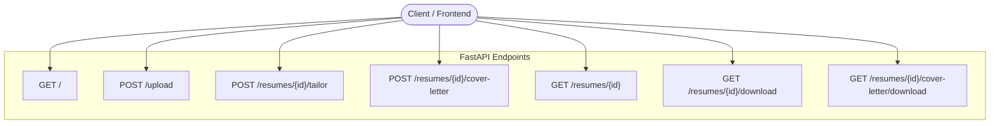

# API Reference

This document provides complete documentation for the **Resume Tailor FastAPI backend**.

---

## 1. Overview & Base URL

The API is built using **FastAPI** and serves JSON data as well as binary file downloads.

- **Base URL (Local):** `http://localhost:8000`
- **Interactive Swagger UI:** `http://localhost:8000/docs`
- **ReDoc UI:** `http://localhost:8000/redoc`



---

## 2. Endpoints Reference

### 2.1 Health Check / Welcome

```http
GET /
```

Returns a basic welcome message and guidance to visit the interactive documentation.

#### Response `200 OK`
```json
{
  "message": "Welcome to Resume Tailor API, Go to /docs to get started"
}
```

---

### 2.2 Upload Resume

```http
POST /upload
```

Upload a resume file in **PDF** (`.pdf`) or **Word** (`.docx`) format. The file is saved in the database and a new resume ID is returned.

#### Request Headers
| Header | Value |
| :--- | :--- |
| `Content-Type` | `multipart/form-data` |

#### Request Body
- `file` (Form-data, File, Required): The resume file (`.pdf` or `.docx`).

#### Response `200 OK`
```json
{
  "id": 1,
  "filename": "my_resume.pdf"
}
```

#### Error Responses
- `400 Bad Request`: If the file extension is not `.pdf` or `.docx`.
  ```json
  {
    "detail": "File must be .pdf or .docx"
  }
  ```

#### Example `curl`
```bash
curl -X POST "http://localhost:8000/upload" \
  -F "file=@/path/to/my_resume.pdf"
```

---

### 2.3 Tailor Resume

```http
POST /resumes/{resume_id}/tailor
```

Extracts text from the uploaded resume, analyzes the provided job description, calls the AI tailoring model, and generates a formatted `.docx` resume.

#### Path Parameters
| Parameter | Type | Description |
| :--- | :--- | :--- |
| `resume_id` | `integer` | The ID returned from the `/upload` endpoint. |

#### Request Headers
| Header | Value |
| :--- | :--- |
| `Content-Type` | `text/plain` |

#### Request Body
- Plain text containing the full target job description.

#### Response `200 OK`
```json
{
  "status": "completed",
  "user_name": "Jane Doe"
}
```

#### Error Responses
- `404 Not Found`: Resume ID not found in database.
  ```json
  {
    "detail": "Resume not found"
  }
  ```

#### Example `curl`
```bash
curl -X POST "http://localhost:8000/resumes/1/tailor" \
  -H "Content-Type: text/plain" \
  --data "Senior Python Engineer needed with FastAPI and AI experience..."
```

---

### 2.4 Generate Cover Letter

```http
POST /resumes/{resume_id}/cover-letter
```

Generates a customized, professional cover letter matching the candidate's resume against the target job description.

#### Path Parameters
| Parameter | Type | Description |
| :--- | :--- | :--- |
| `resume_id` | `integer` | The ID returned from the `/upload` endpoint. |

#### Request Headers
| Header | Value |
| :--- | :--- |
| `Content-Type` | `text/plain` |

#### Request Body
- Plain text containing the full target job description.

#### Response `200 OK`
```json
{
  "status": "completed",
  "user_name": "Jane Doe"
}
```

#### Error Responses
- `404 Not Found`: Resume ID not found in database.
  ```json
  {
    "detail": "Resume not found"
  }
  ```

#### Example `curl`
```bash
curl -X POST "http://localhost:8000/resumes/1/cover-letter" \
  -H "Content-Type: text/plain" \
  --data "We are looking for a Software Engineer to join our team..."
```

---

### 2.5 Get Resume Status & Details

```http
GET /resumes/{resume_id}
```

Retrieves metadata and generation status for a given resume record.

#### Path Parameters
| Parameter | Type | Description |
| :--- | :--- | :--- |
| `resume_id` | `integer` | Unique ID of the resume record. |

#### Response `200 OK`
```json
{
  "id": 1,
  "original_filename": "my_resume.pdf",
  "user_name": "Jane Doe",
  "created_at": "2025-01-15T12:00:00",
  "status": "completed",
  "has_output": true,
  "has_cover_letter": true
}
```

#### Error Responses
- `404 Not Found`: Resume ID not found.

---

### 2.6 Download Tailored Resume

```http
GET /resumes/{resume_id}/download
```

Downloads the tailored resume as a `.docx` Word document.

#### Path Parameters
| Parameter | Type | Description |
| :--- | :--- | :--- |
| `resume_id` | `integer` | Unique ID of the resume record. |

#### Response `200 OK`
- **Content-Type:** `application/vnd.openxmlformats-officedocument.wordprocessingml.document`
- **Content-Disposition:** `attachment; filename="Jane_Doe_resume_1.docx"`
- **Body:** Binary `.docx` file stream.

#### Error Responses
- `400 Bad Request`: If tailoring has not completed yet (`Resume not ready for download`).
- `404 Not Found`: If the resume or output content does not exist.

#### Example `curl`
```bash
curl -O -J "http://localhost:8000/resumes/1/download"
```

---

### 2.7 Download Cover Letter

```http
GET /resumes/{resume_id}/cover-letter/download
```

Downloads the generated cover letter as a `.docx` Word document.

#### Path Parameters
| Parameter | Type | Description |
| :--- | :--- | :--- |
| `resume_id` | `integer` | Unique ID of the resume record. |

#### Response `200 OK`
- **Content-Type:** `application/vnd.openxmlformats-officedocument.wordprocessingml.document`
- **Content-Disposition:** `attachment; filename="Jane_Doe_cover_letter_1.docx"`
- **Body:** Binary `.docx` file stream.

#### Error Responses
- `404 Not Found`: If the resume or cover letter content has not been generated.

#### Example `curl`
```bash
curl -O -J "http://localhost:8000/resumes/1/cover-letter/download"
```

---

## 3. Summary of HTTP Status Codes

| Status Code | Reason | Description |
| :--- | :--- | :--- |
| `200 OK` | Success | The request succeeded and data or file binary was returned. |
| `400 Bad Request` | Client Error | Invalid file format (non-PDF/DOCX) or attempting to download before processing. |
| `404 Not Found` | Not Found | Requested resume ID or generated document does not exist. |
| `413 Payload Too Large` | Size Limit Exceeded | Enforced by `ContentSizeLimitMiddleware` when request payload exceeds the 5MB request body size limit. |
| `429 Too Many Requests` | Rate Limit Exceeded | Enforced by `TokenBucketRateLimiter` when exceeding the rate limit rule of 60 requests per minute. |
| `500 Server Error` | Internal Error | AI API failure or unexpected document processing error. |
