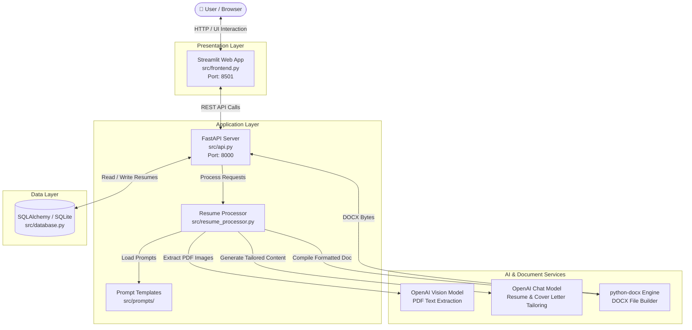
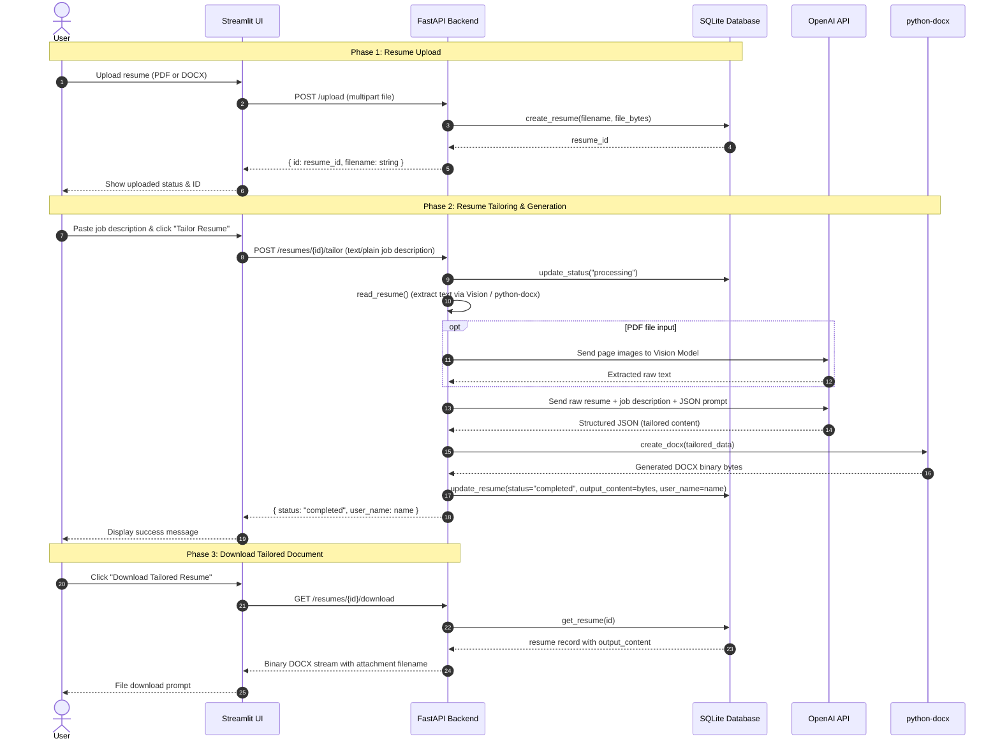
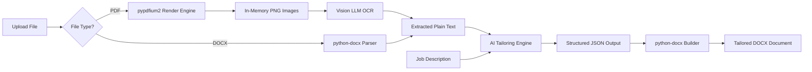

# Architecture Overview

This document describes the system architecture, component design, and data flow of **Resume Tailor**.

---

## 1. High-Level System Architecture

Resume Tailor is built with a decoupled architecture featuring a **Streamlit** user interface, a **FastAPI** backend server, a **SQLAlchemy** database storage layer, and an **AI processing engine** integrating multimodal and chat models.

---

## 2. End-to-End Workflow & Sequence Diagram

The complete user workflow consists of three primary phases: **Upload**, **Tailor / Generate**, and **Download**.

---

## 3. Core Components

### 3.1 Presentation Layer (`src/frontend.py`)
- **Technology:** Streamlit
- **Responsibilities:**
  - Provides a clean, responsive single-page web interface.
  - Handles file uploads (`.pdf`, `.docx`).
  - Accepts target job description input.
  - Triggers asynchronous API calls to the backend.
  - Manages UI session state (`resume_id`, `status`).
  - Provides one-click file download buttons for generated resumes and cover letters.

### 3.2 Application Layer (`src/api.py`)
- **Technology:** FastAPI, Uvicorn
- **Responsibilities:**
  - Exposes RESTful endpoints for resume management.
  - Implements CORS middleware for cross-origin integration.
  - Validates incoming file formats and payload bodies.
  - Coordinates database queries and processing jobs.
  - Streams binary `.docx` downloads with proper HTTP headers (`Content-Disposition`).

### 3.3 Business Logic & Processing (`src/resume_processor.py`)
- **Technology:** OpenAI SDK, `pypdfium2`, `python-docx`, Pillow
- **Responsibilities:**
  - **PDF Text Extraction:** Converts PDF pages to high-resolution PNG images via `pypdfium2` and passes them to a vision model (`gpt-4o-mini`) for structure-preserving OCR.
  - **DOCX Text Extraction:** Reads native `.docx` paragraphs using `python-docx`.
  - **Resume Tailoring:** Formulates structured system and user prompts to rewrite resume bullet points, summaries, and skills to align with the job description.
  - **Cover Letter Generation:** Synthesizes candidate background and job requirements into a compelling, professional cover letter.
  - **DOCX Generation:** Dynamically formats and compiles professional `.docx` files with custom typography, clean spacing, and section headers.

### 3.4 Prompt Templates (`src/prompts/`)
- **`resume_tailor.py`:** Contains system instructions and JSON response schema guidelines enforcing ATS keyword optimization, active verb usage, and realistic alignment.
- **`cover_letter.py`:** Contains prompts guiding the AI to write concise, impact-focused cover letters tailored to the target role.

### 3.5 Data Persistence Layer (`src/database.py`)
- **Technology:** SQLAlchemy ORM, SQLite
- **Responsibilities:**
  - Defines the `Resume` data model.
  - Provides a thread-safe session context manager (`get_session()`).
  - Stores uploaded source files, processing status, job descriptions, and generated output binaries.

---

## 4. Document Ingestion & Processing Pipeline

The ingestion pipeline handles both structured DOCX files and visually formatted PDFs:

---

## 5. Security & Isolation

- **In-Memory Defaults:** The default database runs in SQLite in-memory mode, ensuring no files persist on disk unless explicitly configured with `DATABASE_URL`.
- **Stateless Processing:** Uploaded files and temporary images generated during PDF OCR are immediately unlinked and removed from disk after processing.
- **Environment Isolation:** API keys and sensitive settings are strictly read from environment variables and never exposed to the client.
