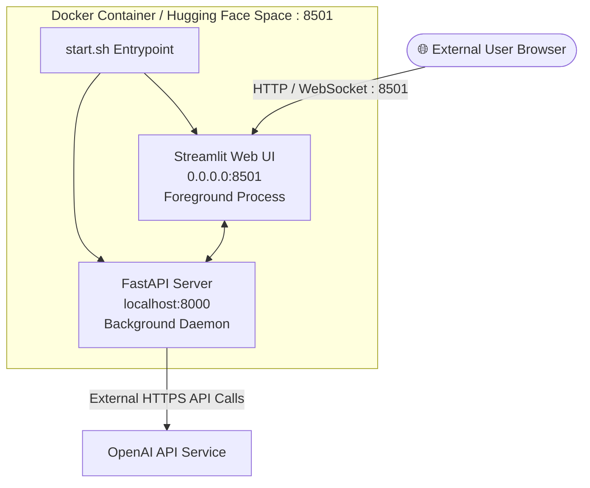

# Deployment Guide

This guide details how to deploy **Resume Tailor** across containerized and cloud environments, including Docker and Hugging Face Spaces.

---

## 1. Deployment Architecture

Resume Tailor runs as a self-contained container running both the FastAPI backend service and the Streamlit frontend.



---

## 2. Deploying to Hugging Face Spaces

Resume Tailor is pre-configured for one-click deployment on **Hugging Face Spaces** using the Docker SDK.

### Step 1: Create a Space on Hugging Face
1. Navigate to [Hugging Face Spaces](https://huggingface.co/spaces) and click **Create new Space**.
2. Name your Space (e.g. `resume-tailor`).
3. Select **Docker** as the Space SDK.
4. Set Space visibility to **Public** or **Private**.

### Step 2: Configure Secrets
In your Hugging Face Space settings:
1. Go to **Settings** > **Variables and secrets**.
2. Add a new **Secret**:
   - **Key:** `OPENAI_API_KEY`
   - **Value:** `your-openai-api-key-here`
3. (Optional) Add variables for custom models:
   - `AI_MODEL` = `gpt-4o-mini`
   - `VISION_MODEL` = `gpt-4o-mini`

### Step 3: Push Code to Space
Clone your Space repository and push this codebase:

```bash
git remote add space https://huggingface.co/spaces/<your-username>/<your-space-name>
git push space master:main
```

### Automated Sync via GitHub Actions
The repository includes `.github/workflows/sync-to-hf.yml`. To enable automatic synchronization from GitHub to Hugging Face:
1. Add `HF_TOKEN` to your GitHub Repository Secrets.
2. Ensure the destination Hugging Face Space repository URL matches your space in the workflow file.

---

## 3. Docker Deployment

### 3.1 Build the Docker Image

Run the following command in the project root:

```bash
docker build -t resume-tailor:latest .
```

### 3.2 Run the Docker Container

Run the container exposing port `8501` and passing your `OPENAI_API_KEY`:

```bash
docker run -d \
  --name resume-tailor-app \
  -p 8501:8501 \
  -e OPENAI_API_KEY="sk-proj-your-key-here" \
  resume-tailor:latest
```

Access the application in your browser at `http://localhost:8501`.

### 3.3 Running with Persistent Database Volume

By default, an in-memory SQLite database is used. To persist resumes across container restarts, mount a host directory and set `DATABASE_URL`:

```bash
docker run -d \
  --name resume-tailor-app \
  -p 8501:8501 \
  -v $(pwd)/data:/app/data \
  -e OPENAI_API_KEY="sk-proj-your-key-here" \
  -e DATABASE_URL="sqlite:////app/data/resume.db" \
  resume-tailor:latest
```

---

## 4. Docker Compose Deployment

For multi-container or orchestrated deployments, you can use `docker-compose.yml`:

```yaml
version: '3.8'

services:
  resume-tailor:
    build: .
    ports:
      - "8501:8501"
    environment:
      - OPENAI_API_KEY=${OPENAI_API_KEY}
      - AI_MODEL=gpt-4o-mini
      - VISION_MODEL=gpt-4o-mini
      - DATABASE_URL=sqlite:////app/data/resume.db
    volumes:
      - ./data:/app/data
    restart: unless-stopped
```

Start the service:

```bash
docker compose up -d
```

---

## 5. Production Best Practices

1. **Security & Secrets:** Never bake API keys into Docker images. Always supply keys at runtime via environment variables or secret managers.
2. **Reverse Proxy & TLS:** In production environments, place the application behind a reverse proxy (e.g. NGINX, Caddy, Cloudflare) with HTTPS termination.
3. **Resource Limits:** In Docker / Kubernetes, allocate at least 1 CPU core and 1GB RAM to handle image rendering with `pypdfium2` smoothly.
4. **Database Backups:** When using persistent SQLite or PostgreSQL, schedule automated database backups of the `data/` volume or relational database instance.
